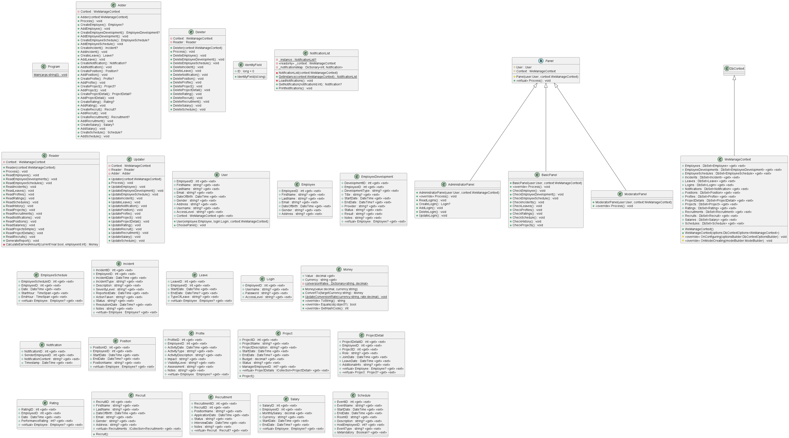

# WeManage - System do Zarządzania Bazą Danych Pracowników

## Struktura Projektu

- **Pełne Kody**
  - `Controllers`
  - `Entities`
  - `Queries`
  - `Program.cs`

- **Binaria**
  - `bin`
  - `obj`

- **Diagram Klas**
  - 

- **Dokumentacja**
  - [Dokumentacja Użytkowa](Documents/usecase.md)
  - [Dokumentacja Instalacyjno-Konfiguracyjna](Documents/install.md)
  - [Lista Wzorców](Documents/patterns.md)
